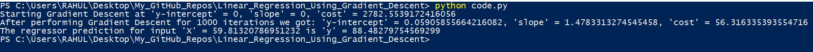

# Linear_Regression_Using_Gradient_Descent

This project is done using pure Python and NumPy

## Libraries

- NumPy
- Good Old Python(3.6+)

#### Run the Project as specified

Clone or Download the project

```
git clone https://github.com/Rahulreigns016/Linear_Regression_Using_Gradient_Descent.git
```

Open Terminal or Cmd Prompt and cd into the project

```
cd Linear_Regression_Using_Gradient_Descent
```

Run the following Command

```
python code.py
```

#### Sample Output


